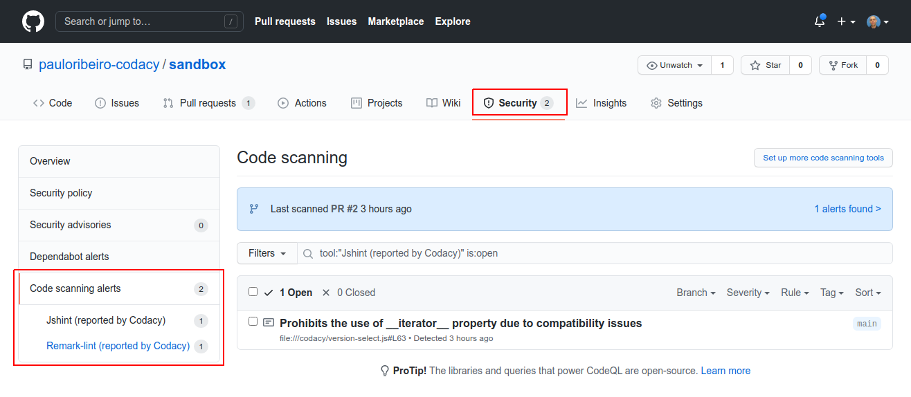

# Codacy GitHub Action

[](https://www.codacy.com/gh/codacy/codacy-analysis-cli-action/dashboard?utm_source=github.com&amp;utm_medium=referral&amp;utm_content=codacy/codacy-analysis-cli-action&amp;utm_campaign=Badge_Grade)

GitHub Action for running Codacy static analysis on [over 30 supported languages](https://docs.codacy.com/getting-started/supported-languages-and-tools/) simultaneously and returning identified issues in the code.

<br/>

<a href="https://www.codacy.com" target="_blank"></a>

<br/>

[Codacy](https://www.codacy.com/) is an automated code review tool that monitors your technical debt, helps you improve your code quality, teaches best practices to your developers, and helps you save time in code reviews:

-   Identify new static analysis issues
-   Commit and pull request analysis with GitHub
-   Auto-comments on commits and pull requests
-   Integrations with Slack and Jira
-   Track issues in Code Style, Security, Error Proneness, Performance, Unused Code and other categories

Codacy also helps keep track of Code Coverage, Code Duplication, and Code Complexity.

Codacy supports PHP, Python, Ruby, Java, JavaScript, and Scala, among others, and is free for Open Source projects.

## Default settings

By default, the GitHub action:

-   Analyzes each commit or pull request by running all the supported static code analysis tools for the languages in your repository, with their default configurations.
-   Prints the analysis results on the console, which is visible on the GitHub Action's workflow panel.  
-   Fails the workflow if it finds at least one issue in your code.

To use the GitHub Action, add the following to a file `.github/workflows/codacy-analysis.yaml` in your repository:

```yaml
name: Codacy Analysis CLI

on: ["push"]

jobs:
  codacy-analysis-cli:
    name: Codacy Analysis CLI
    runs-on: ubuntu-latest
    steps:
      - name: Checkout code
        uses: actions/checkout@master

      - name: Run Codacy Analysis CLI
        uses: codacy/codacy-analysis-cli-action@master
```

## Integration with GitHub code scanning

When integrating with [GitHub code scanning](https://docs.github.com/github/finding-security-vulnerabilities-and-errors-in-your-code/about-code-scanning), the GitHub action:

-   Analyzes each commit or pull request by running all the supported static code analysis tools for the languages in your repository, with their default configurations.
-   Generates an output file `results.sarif` containing the analysis results
-   Uploads the file `results.sarif` to GitHub, which then displays the analysis results under the tab **Security**, page **Code scanning alerts**.



To use the GitHub Action with GitHub code scanning integration, add the following to a file `.github/workflows/codacy-analysis.yaml` in your repository:

```yaml
name: Codacy Security Scan

on:
  push:
    branches: [ "master", "main" ]
  pull_request:
    branches: [ "master", "main" ]

jobs:
  codacy-security-scan:
    name: Codacy Security Scan
    runs-on: ubuntu-latest
    steps:
      - name: Checkout code
        uses: actions/checkout@master

      - name: Run Codacy Analysis CLI
        uses: codacy/codacy-analysis-cli-action@master
        with:
          output: results.sarif
          format: sarif
          # Adjust severity of non-security issues
          gh-code-scanning-compat: true
          # Force 0 exit code to allow SARIF file generation
          # This will handover control about PR rejection to the GitHub side
          max-allowed-issues: 2147483647
      
      # Upload the SARIF file generated in the previous step
      - name: Upload SARIF results file
        uses: github/codeql-action/upload-sarif@master
        with:
          sarif_file: results.sarif
```

## Extra configurations

The Codacy GitHub Action is a wrapper for running the [Codacy Analysis CLI](https://github.com/codacy/codacy-analysis-cli) and supports [the same parameters as the command `analyze`](https://github.com/codacy/codacy-analysis-cli#commands-and-configuration), with the following exceptions:

- `--commit-uuid` (the action always analyzes the commit that triggered it)
- `--api-token`, `--username`, and `--project` (use [`--project-token`](https://github.com/codacy/codacy-analysis-cli#project-token) instead)

When using `--project-token` make sure that you use [GitHub security features](https://docs.github.com/en/actions/reference/encrypted-secrets)
to avoid committing the secret token to your repository. For example, if you store your Codacy project
token in GitHub, this is how you would use it in the action workflow:

```yaml
# ...
uses: codacy/codacy-analysis-cli-action@master
with:
    project-token: ${{ secrets.<PROJECT_TOKEN_NAME> }}
# ...
```

## Contributing

We love contributions, feedback, and bug reports.
If you run into issues while running this action,
[open an issue](https://github.com/codacy/codacy-analysis-cli-action/issues) in this repository.
